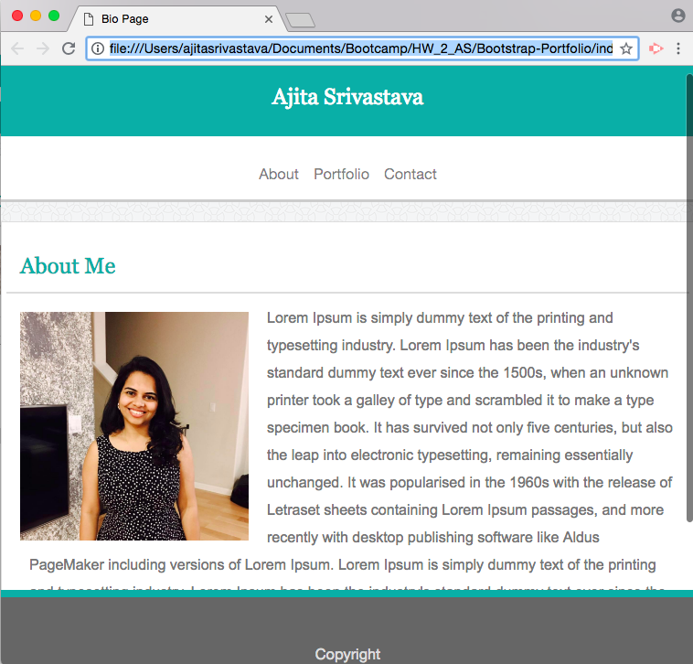

# Responsive-Portfolio

<!-- Put a description of what the project is -->
Learning Responsive pages: media queries, responsiveness, float, positioning

## Link to deployed site
<!-- make a link to the deployed site --> 
<!-- [What the user will see](the link to the deployed site) -->
[responsive-portfolio](https://ajitas.github.io/Responsive-Portfolio/)

## Images
<!-- take a picture of the image and add it into the readme  -->
<!--  -->


## technology used
<!-- make a list of technology used -->
<!-- what you used for this web app, like html css -->

<!-- 
1. First ordered list item
2. Another item
⋅⋅* Unordered sub-list. 
1. Actual numbers don't matter, just that it's a number
⋅⋅1. Ordered sub-list
4. And another item. 
-->
1. HTML
2. CSS
    * position
    * padding
    * pseudo classes
    * float
    * responsiveness
3. Media Queries


## code snippets
<!-- put snippets of code inside ``` ``` so it will look like code -->
<!-- if you want to put blockquotes use a > -->

```
@media screen and (max-width: 980px) {

   .PageContent {
        width:550px;
        margin-left:40px;
    }

    .headingwithnav {
        width:100%;
        margin-left:40px;
    }

    nav {
        margin-right:60px;
    }
    .portfolioimage {
        width:250px;
        height:250px;
    }
    .portfolioimageswithdesc
    {
        margin-top:20px;  
    }
    .descriptionofimage {
        width:250px;
        padding-top:15px;
        padding-bottom:15px;
        bottom:15px;
    }
    #portfolioimageswithdesc1, #portfolioimageswithdesc3, #portfolioimageswithdesc5 {
        margin-right:20px;
        margin-bottom:20px;
    }
    
    #portfolioimageswithdesc2, #portfolioimageswithdesc4{
        margin-left:30px;
        margin-bottom:20px;
    }

}

@media screen and (max-width: 768px) {

    .PageContent {
         width:680px;
         margin:auto;
         margin-top:20px;
         margin-bottom:300px;
     }
 
     .headingwithnav {
         width:100%;
         margin-left:18px;
     }
 
     nav {
         margin-right:40px;
     }
     #bioimage {
        width:250px;
        height:250px;
    }
    .portfolioimage {
        width:315px;
        height:315px;
    }
    .portfolioimageswithdesc
    {
        margin-top:20px;  
    }
    .descriptionofimage {
        width:315px;
        padding-top:20px;
        padding-bottom:20px;
        bottom:20px;
    }
    
 }

 @media screen and (max-width: 640px) {

    .PageContent {
         width:500px;
         margin:auto;
         margin-top:20px;
         margin-bottom:300px;
     }

     #bioimage {
         float:none;
         width:400px;
         height:400px;
     }
     #biotext, #bioimage {
         padding-left:50px;
     }

     #biotext {
        padding-right:70px;
     }
 
     .headingwithnav {
         width:100%;
         margin-left:0px;
         float:none;
         
     }
 
     nav {
         margin:auto;
         float:none;
         text-align:center;
         padding-bottom:25px;
         width:100%;
         border-bottom:#cccccc 1px solid;
         background:white;
         
     }
     header {
         float:none;
         width:100%;

     }

     .portfolioimage {
        width:500px;
        height:500px;
    }
    .portfolioimageswithdesc
    {
        margin-top:20px;  
        float:none;
    }
    .descriptionofimage {
        width:500px;
        padding-top:25px;
        padding-bottom:25px;
        bottom:25px;
    }

    #portfolioimageswithdesc2, #portfolioimageswithdesc4{
        margin-left:0px;
        margin-bottom:20px;
    }
 }
```
## Learning points
* How a web page is made responsive with media queries
* How the sequence of media queries affect the layout


## Author 
[Ajita Srivastava](https://github.com/ajitas)

## License
Standard MIT License
